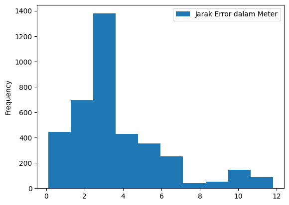
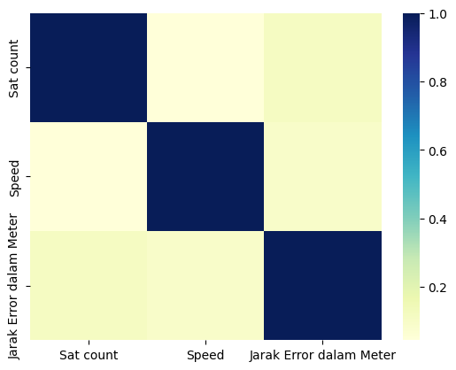
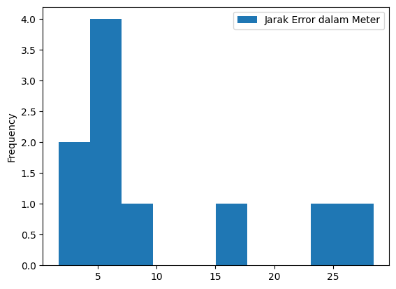

## Script untuk menghitung jarak error antara koordinat GPS

karena saya tidak bisa menghitung jarak error antara koordinat GPS tanpa membuat kesalahan, maka dari itulah script ini dibuat. Script ini dibuat berdasarkan sebuah formula yang saya dapatkan dari jurnal berjudul "Implementasi Internet of Things pada Sistem Informasi Pelacakan Kendaraan Bermotor Menggunakan GPS Berbasis Web".

berikut adalah formula yang digunakan untuk menghitung koordinat: 

$ Z=\sqrt{(B-A)^2-(D-C)^2}$

A = nilai latitude yang sebenarnya
\
B = nilai latitude dari modul
\
C = nilai longitude yang sebenarnya
\
D = nilai longitude dari modul
\
1 derajat di maps = 111.322 kilometer


### Journal Link
Jurnal bisa didapatkan pada [jtika.if.unram.ac.id](https://bit.ly/3jALUFb)


### Requirements 
Berikut adalah requirements yang dibutuhkan untuk menjalankan script ini

- numpy
- pandas
- seaborn
- matplotlib


```python
import matplotlib
import numpy as np
import pandas as pd
import seaborn as sns
```

## Menghitung jarak error untuk lokasi yang sama
### Extract Data

Mengambil data dari file csv, data terdiri dari data pembacaan sensor GPS Modul Ublox Neo6M yang
diberi column Latitude modul dan Longitude modul, lalu data dari sensor GPS smartphone yang diberi
column Latitude referensi dan Longitude referensi, pada file csv juga terdapat column sat count yang
merupakan jumlah satelit, lalu speed yang data kecepatan, dan altitude yang merupakan data ketinggian
ketiga column tadi merupakan milik dari koordinat modul.


```python
def dataFrame(csvFile):
    csvData = pd.read_csv(csvFile)
    csvData['Dates'] = pd.to_datetime(csvData['Dates'])
    return csvData
```


```python
df = dataFrame('GPSData.csv')
df.head(5)
```


<div>
<style scoped>
    .dataframe tbody tr th:only-of-type {
        vertical-align: middle;
    }

    .dataframe tbody tr th {
        vertical-align: top;
    }

    .dataframe thead th {
        text-align: right;
    }
</style>
<table border="1" class="dataframe">
  <thead>
    <tr style="text-align: right;">
      <th></th>
      <th>Latitude referensi</th>
      <th>Longitude referensi</th>
      <th>Latitude modul</th>
      <th>Longitude modul</th>
      <th>Sat count</th>
      <th>Speed</th>
      <th>Alt</th>
      <th>Dates</th>
    </tr>
  </thead>
  <tbody>
    <tr>
      <th>0</th>
      <td>-5.372151</td>
      <td>105.250096</td>
      <td>-5.372164</td>
      <td>105.250105</td>
      <td>0</td>
      <td>0.43</td>
      <td>0.0</td>
      <td>2021-09-14</td>
    </tr>
    <tr>
      <th>1</th>
      <td>-5.372151</td>
      <td>105.250096</td>
      <td>-5.372164</td>
      <td>105.250105</td>
      <td>0</td>
      <td>0.43</td>
      <td>0.0</td>
      <td>2021-09-14</td>
    </tr>
    <tr>
      <th>2</th>
      <td>-5.372151</td>
      <td>105.250096</td>
      <td>-5.372164</td>
      <td>105.250105</td>
      <td>0</td>
      <td>0.43</td>
      <td>0.0</td>
      <td>2021-09-14</td>
    </tr>
    <tr>
      <th>3</th>
      <td>-5.372151</td>
      <td>105.250096</td>
      <td>-5.372164</td>
      <td>105.250105</td>
      <td>0</td>
      <td>0.43</td>
      <td>0.0</td>
      <td>2021-09-14</td>
    </tr>
    <tr>
      <th>4</th>
      <td>-5.372151</td>
      <td>105.250096</td>
      <td>-5.372162</td>
      <td>105.250092</td>
      <td>0</td>
      <td>0.07</td>
      <td>0.0</td>
      <td>2021-09-14</td>
    </tr>
  </tbody>
</table>
</div>


### Data Preparation

Selanjutnya data akan dipisahkan dan diubah menjadi sebuah array sesuai nama kolom masing-masing, untuk
selanjutnya dilakukan perhitungan menggunakan rumus berikut.


```python
def dataToArray(dataFrame):
    latitudeReal = dataFrame['Latitude referensi'].to_numpy()
    longitudeReal = dataFrame['Longitude referensi'].to_numpy()
    latitudeModul = dataFrame['Latitude modul'].to_numpy()
    longitudeModul = dataFrame['Longitude modul'].to_numpy()
    
    return (latitudeReal, longitudeReal, latitudeModul, longitudeModul)
```


```python
latReal, longReal, latModul, longModul = dataToArray(df)
```

### Data Processing
Pada bagian ini data yang telah dipisahkan sesuai dengan nama kolom masing-masing akan diproses, untuk menghitung
selisih jarak antara koordinat Modul GPS dan koordinat GPS Smartphone, perhitungan selisih jarak dilakukan dengan
menggunakan formula sebagai berikut.

$ Z=\sqrt{(B-A)^2-(D-C)^2}$

A = nilai latitude yang sebenarnya
\
B = nilai latitude dari modul
\
C = nilai longitude yang sebenarnya
\
D = nilai longitude dari modul
\
1 derajat di maps = 111.322 kilometer


```python
def dataProcessing(latReal, longReal, latModul, longModul):
    Z = (latModul - latReal)**2 + (longModul - longReal)**2
    result = np.sqrt(Z)

    z = result * 111.322
    converttoMeter = z * 1000
    datainMeter = np.around(converttoMeter,2)
    
    resultData = pd.DataFrame(datainMeter, columns=['Jarak Error dalam Meter'])
    return resultData
```


```python
resultData = dataProcessing(latReal, longReal, latModul, longModul)
```

### Visualisasi Data

Setelah perhitungan selesai dilakukan, selanjutnya kita akan melihat distribusi dari data hasil perhitungan dengan membuat visualisasi dari data yang telah diproses. Dalam membuat visualisasi data kita akan menggunakan histogram untuk membantu kita agar lebih mudah untuk melihat persebaran dari data yang ada.


```python
def histogram(dataSource):
    hist = dataSource.plot.hist()
    median = np.median(dataSource)
    print("nilai rata-rata jarak error: {} meter".format(median))
    return hist
```


```python
histogram(resultData)
```

    nilai rata-rata jarak error: 3.08 meter


    <AxesSubplot:ylabel='Frequency'>


    

    


Dari Distribusi data di atas dapat dilihat bahwa distribusi data-nya miring dengan variasi data dari 0-12 meter
dan didapatkan nilai rata-rata dari data yaitu 3.08 meter.

### Korelasi Data

Pada plot heatmap di bawah ini kita bisa melihat korelasi antara 3 data yaitu data jumlah satelit, data kecepatan,
dan data nilai jarak error untuk membuktikan apakah ketiga data tersebut saling berpengaruh.


```python
def pearsonCorrelation(dataFrame, resultDataFrame):
    sateliteAndSpeed = dataFrame[['Sat count','Speed']]
    mergedDataFrame = pd.concat([sateliteAndSpeed, resultDataFrame], axis=1)
    sns.heatmap(mergedDataFrame.corr(method='pearson'), cmap="YlGnBu")
```


```python
pearsonCorrelation(df, resultData)
```


    

    


Dari grafik heatmap dan table data di atas dapat dilihat hubungan dari 3 data yaitu Sat count, Speed, dan Jarak Error yang dapat dikatakan rendah karena dari semua data tersebut, menghasilkan nilai koefisien korelasi di bawah 0,2.

## Menghitung Jarak Error untuk masing-masing lokasi yang berbeda

### Extract Data

Pada bagian ini kita akan menghitung selisih jarak error untuk data GPS dengan masing-masing lokasi yang berbeda
dalam file .csv, terdapat 10 data yang diambil dari sensor GPS Neo-6M dan sensor GPS Smartphone sebagai koordinat sebenarnya untuk menguji keakuratan dari sensor GPS Neo-6M.


```python
df1 = pd.read_csv("GPSDataDiffLoc.csv")
df1.head()
```


<div>
<style scoped>
    .dataframe tbody tr th:only-of-type {
        vertical-align: middle;
    }

    .dataframe tbody tr th {
        vertical-align: top;
    }

    .dataframe thead th {
        text-align: right;
    }
</style>
<table border="1" class="dataframe">
  <thead>
    <tr style="text-align: right;">
      <th></th>
      <th>Latitude referensi</th>
      <th>Longitude referensi</th>
      <th>Latitude modul</th>
      <th>Longitude modul</th>
    </tr>
  </thead>
  <tbody>
    <tr>
      <th>0</th>
      <td>-5.374139</td>
      <td>105.251474</td>
      <td>-5.374128</td>
      <td>105.251464</td>
    </tr>
    <tr>
      <th>1</th>
      <td>-5.372796</td>
      <td>105.252211</td>
      <td>-5.372755</td>
      <td>105.252252</td>
    </tr>
    <tr>
      <th>2</th>
      <td>-5.373251</td>
      <td>105.250850</td>
      <td>-5.373214</td>
      <td>105.250899</td>
    </tr>
    <tr>
      <th>3</th>
      <td>-5.370245</td>
      <td>105.249765</td>
      <td>-5.370484</td>
      <td>105.249675</td>
    </tr>
    <tr>
      <th>4</th>
      <td>-5.372938</td>
      <td>105.245634</td>
      <td>-5.372891</td>
      <td>105.245596</td>
    </tr>
  </tbody>
</table>
</div>


### Data preparation

Selanjutnya seperti bagian sebelumnya data akan dipisahkan sesuai dengan nama kolom masing-masing untuk selanjutnya, dilakukan proses perhitungan.


```python
latitudeReal, longitudeReal, latitudeModul, longitudeModul = dataToArray(df1)
```

### Data Processing

Selanjutnya akan dilakukan perhitungan terhadap data yang telah dipersiapkan.


```python
resultDataFrame = dataProcessing(latitudeReal, longitudeReal, latitudeModul, longitudeModul)
resultDataFrame.head()
```


<div>
<style scoped>
    .dataframe tbody tr th:only-of-type {
        vertical-align: middle;
    }

    .dataframe tbody tr th {
        vertical-align: top;
    }

    .dataframe thead th {
        text-align: right;
    }
</style>
<table border="1" class="dataframe">
  <thead>
    <tr style="text-align: right;">
      <th></th>
      <th>Jarak Error dalam Meter</th>
    </tr>
  </thead>
  <tbody>
    <tr>
      <th>0</th>
      <td>1.67</td>
    </tr>
    <tr>
      <th>1</th>
      <td>6.41</td>
    </tr>
    <tr>
      <th>2</th>
      <td>6.86</td>
    </tr>
    <tr>
      <th>3</th>
      <td>28.44</td>
    </tr>
    <tr>
      <th>4</th>
      <td>6.66</td>
    </tr>
  </tbody>
</table>
</div>


### Data Visualization

Selanjutnya akan dilakukan visualisasi data untuk melihat persebaran atau distribusi dari data yang telah diproses.


```python
histogram(resultDataFrame)
```

    nilai rata-rata jarak error: 6.76 meter


    <AxesSubplot:ylabel='Frequency'>


    

    


Dari visualisasi data di atas dapat dilihat persebaran data sangat bervariasi dengan nilai terendah berkisar 1 meter sampai dengan nilai tertinggi berkisar 28 meter, dengan nilai tengah 6.76 meter.
